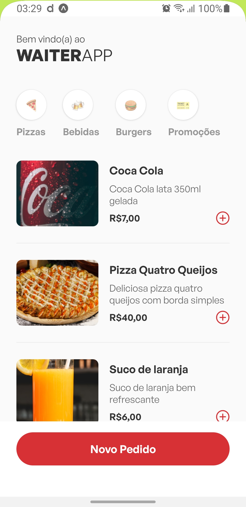
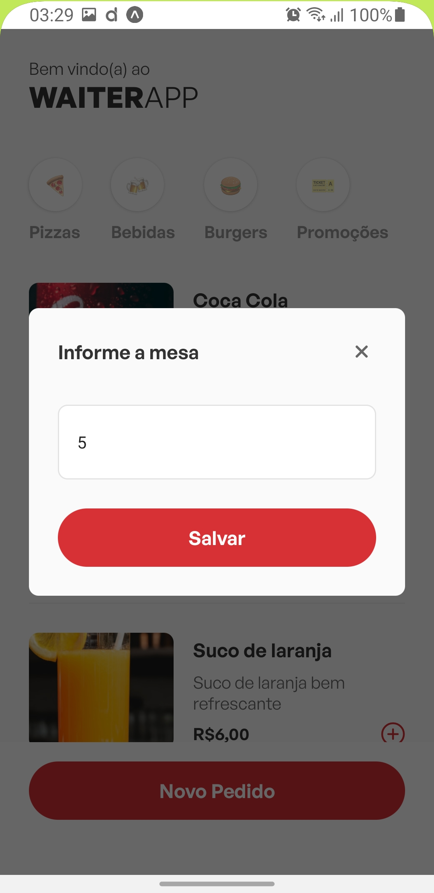
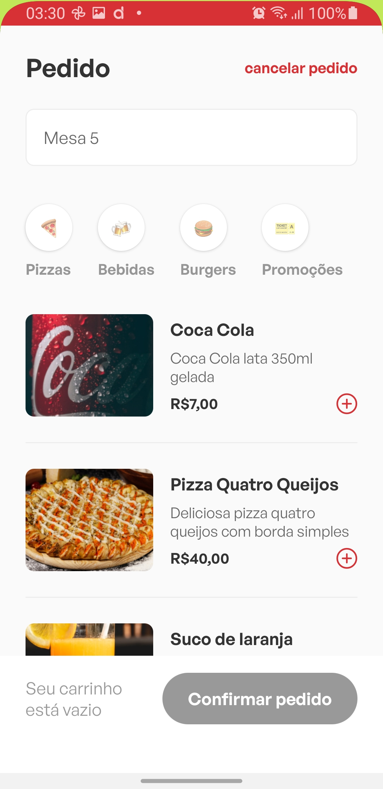
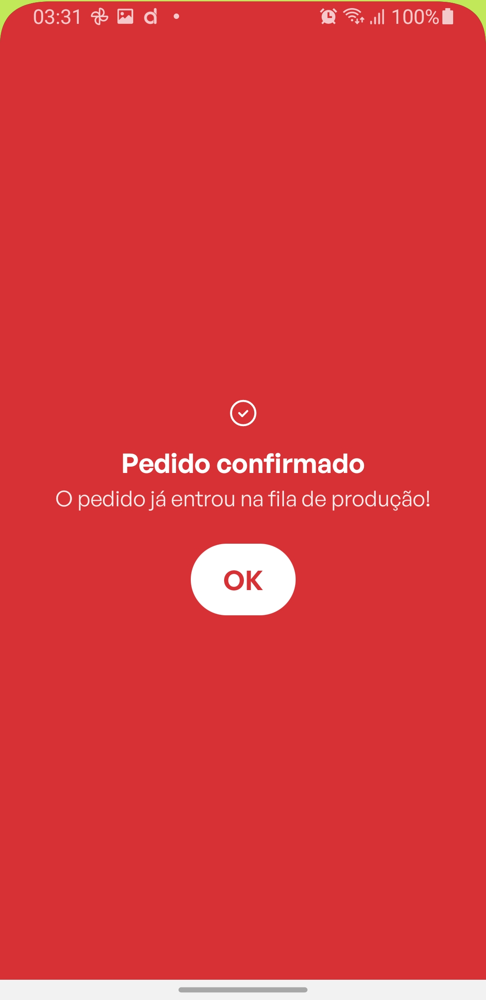

<h1 align="center">Waiter App</h1>

  
  
  
  

## Tecnologias

Esse projeto foi desenvolvido com as seguintes tecnologias:

- [React](https://reactjs.org)
- [React Native](https://reactnative.dev)
- [Expo](https://expo.io)
- [TypeScript](https://www.typescriptlang.org)
- [Styled Components](https://styled-components.com)

## Projeto

Waiter App: E um app para fazer o seu pedido em um restaurante

## Para rodar o projeto:

- Instale os módulos: `npm install` ou `yarn`
- Rode: `npx expo start`
